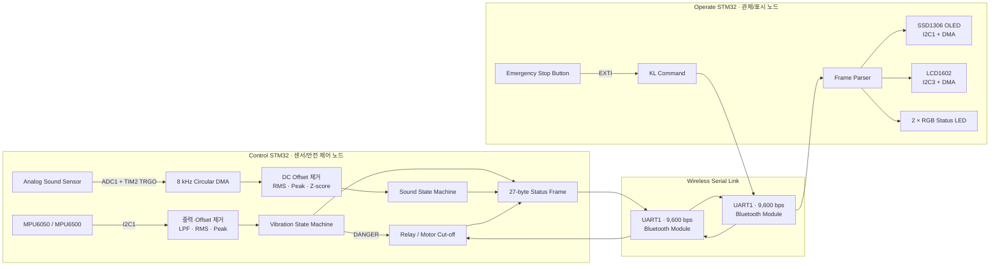
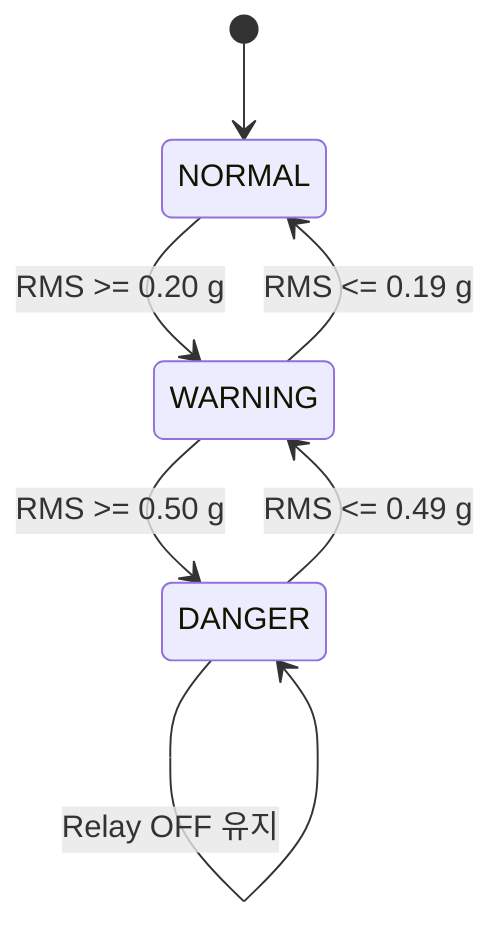

# Dual-STM32 Rotating Machine Safety Monitor

> 두 대의 STM32F411을 이용해 회전체의 **진동·소음 이상을 감지하고, 위험 시 모터를 정지하며, 현장 상태를 별도 관제 장치에 표시하는 임베디드 안전 모니터링 시스템**


📽️ **프로젝트 발표 자료:** [Google Slides에서 보기](https://docs.google.com/presentation/d/1Spu_YAhn0_uRUU4AssLU5sAD3X2Ham988HaG6hLbSTw/edit?usp=sharing)

## 1. 프로젝트 개요

모터·팬·발전기와 같은 회전체는 베어링 마모, 축 정렬 불량, 체결부 이완이 발생하면 평소와 다른 **진동과 소음**을 만든다. 이 프로젝트는 이러한 변화를 MCU에서 직접 수집·가공해 상태를 판정하고, 위험 상황에서는 릴레이를 차단하는 엣지 기반 상태 감시 장치를 구현한다.

시스템은 역할이 다른 두 개의 펌웨어로 구성된다.

- **Control STM32**: MPU6050/MPU6500과 아날로그 사운드 센서를 수집하고, 진동·소음 상태를 판정하며, DANGER 상황 또는 비상 정지 명령에서 릴레이로 전원을 차단한다.
- **Operate STM32**: Control 노드가 전송한 상태를 OLED, LCD1602, RGB LED에 표시하고, 현 상황을 상황실에서 판단 후 위험 상황시 버튼으로 원격 비상 정지 명령을 전송한다.

단순 센서 출력에 그치지 않고, **Control 펌웨어의 신호 수집·전처리·특징 추출·상태 판정·안전 제어**와 **Operate 펌웨어의 데이터 수신·상태 표시**를 연동하여 하나의 **분산 임베디드 모니터링 시스템**으로 구현한 것이 핵심이다.

### 핵심 결과

| 구분 | 구현 내용 |
| --- | --- |
| 분산 구조 | 센서·제어 노드와 관제·표시 노드를 2개의 STM32F411로 분리 |
| 진동 분석 | 3축 가속도에서 설치 방향·중력 기준을 제거하고 Mean, RMS, Peak 계산 |
| 소음 분석 | 8 kHz ADC-DMA 수집, DC offset 제거, RMS/Peak 및 rolling Z-score 계산 |
| 상태 판정 | 진동 `NORMAL → WARNING → DANGER`, 소음 `NORMAL ↔ WARNING` 상태 머신 |
| 오검출 억제 | 히스테리시스, 연속 판정(persistence), 정상 기준선 동결 전략 적용 |
| 안전 제어 | 진동 DANGER 및 원격 `KL` 명령을 릴레이 OFF 동작으로 연결 |
| 비동기 I/O | ADC, Bluetooth UART, OLED/LCD I2C 전송에 DMA 활용 |
| 장애 복구 | MPU 초기화 재시도, 연속 읽기 실패 감지, I2C 재초기화와 진동 기준 재설정 |
| 관제 UI | OLED·LCD·RGB LED를 서로 다른 주기로 갱신해 상태와 센서 값을 표현 |

## 2. 시스템 아키텍처



### 노드를 분리한 이유와 효과

| 관심사 | Control STM32 | Operate STM32 |
| --- | --- | --- |
| 주요 책임 | 센싱, 신호 처리, 상태 판정, 모터 차단 | 데이터 수신, HMI, 사용자 비상 정지 입력 |
| 시간 민감 작업 | ADC 샘플링, 센서 읽기, 릴레이 제어 | 화면 DMA 전송, LED 갱신, 버튼 인터럽트 |
| 장애 영향 범위 | 표시 장치 지연과 무관하게 로컬 위험 판정 가능 | 센서 노드의 복잡한 처리와 분리된 UI 갱신 |
| 확장 방향 | 센서·진단 알고리즘 추가 | 디스플레이·통신 채널 추가 |

이 구조는 한 MCU의 디스플레이 처리 지연이 센서 수집과 안전 제어에 직접 영향을 주는 것을 줄이고, 센서 노드와 사용자 인터페이스를 독립적으로 확장할 수 있게 한다.

## 3. 동작 시나리오

### 정상 운전

1. Control 노드는 부팅 시 릴레이를 ON하고 MPU 센서 초기화를 최대 3회 시도한다.
2. 사운드 센서는 TIM2 TRGO가 만든 8 kHz 주기로 ADC 변환되며, 1,600-sample circular DMA 버퍼에 저장된다.
3. DMA half/full callback은 각각 800-sample 구간이 준비되었음을 플래그로 알린다.
4. 메인 루프는 준비된 구간의 DC 성분을 제거한 뒤 RMS, Peak, Z-score를 계산한다.
5. MPU의 3축 가속도는 동적으로 추적한 중력·설치 offset을 제거하고 4-sample window의 RMS와 Peak로 변환된다.
6. Control 노드는 2초마다 상태 프레임을 Bluetooth UART로 송신한다.
7. Operate 노드는 수신 프레임을 파싱해 RGB LED는 100 ms, OLED는 1초, LCD는 2초 주기로 갱신한다.

### 진동 위험 감지



상태는 한 번에 한 단계씩 이동한다. 즉, 큰 진동이 처음 감지되더라도 `NORMAL → WARNING`을 거친 뒤 다음 유효 window에서 `DANGER`로 진입한다. 복귀 임계값에는 0.01 g 히스테리시스를 적용해 경계값 주변의 채터링을 줄였다. 현재 임계값은 조립체에서 최종 교정하기 전의 **동작 검증용 값**이다.

### 비상 정지

1. 관제 노드의 PA12 버튼이 falling-edge EXTI를 발생시킨다.
2. ISR callback은 긴 통신 작업을 직접 수행하지 않고 `kill_request` 플래그만 설정한다.
3. 메인 루프가 UART의 READY 상태를 확인한 후 `KL` 2-byte 명령을 DMA로 전송한다.
4. Control 노드는 명령을 수신하면 릴레이를 OFF해 모터 전원을 차단하도록 설계되어 있다.

인터럽트에서는 상태만 기록하고 실제 UART 전송은 메인 컨텍스트에서 처리하는 방식으로 ISR을 짧게 유지했다.

## 4. 핵심 구현 상세

### 4.1 MPU6050/MPU6500 센서 드라이버

[`mpu6050.c`](control-stm32/MyApp/hw/sjh_driver/mpu6050.c)는 단순 레지스터 read wrapper가 아니라 센서 탐색, 모델 식별, 설정, 단위 변환, 오류 상태 추적을 하나의 드라이버로 캡슐화한다.

- I2C 주소 `0x68`, `0x69`를 탐색한다.
- `WHO_AM_I` 값 `0x68`(MPU6050), `0x70`(MPU6500)을 모두 인식한다.
- DLPF 약 41~42 Hz, 내부 sample rate 125 Hz로 설정한다.
- 가속도 범위는 실제 레지스터 값 `ACCEL_CONFIG = 0x08`에 따라 ±4 g, scale factor 8,192 LSB/g를 사용한다.
- 자이로 범위는 ±250 dps, 131 LSB/(deg/s)를 사용한다.
- 가속도·온도·자이로 14 byte를 burst read한 뒤 물리 단위로 변환한다.
- I2C 동작별 최대 3회 재시도하고 마지막 HAL error code와 실패 register를 보존한다.
- 애플리케이션에서 3회 연속 읽기 실패 시 센서를 비활성 상태로 전환하고, 1초 간격으로 I2C와 센서를 재초기화한다.

재초기화 성공 후 기존 중력·offset 기준을 폐기하고 진동 처리기를 다시 초기화해, 끊어진 센서의 과거 상태가 새 측정에 섞이지 않게 했다.

### 4.2 진동 신호 처리

진동 처리 파이프라인은 [`vibration.c`](control-stm32/MyApp/hw/sjh_driver/vibration.c)에, 상태 전이는 [`vibration_state.c`](control-stm32/MyApp/hw/sjh_driver/vibration_state.c)에 분리되어 있다.

#### 1) 중력 및 설치 offset 추적

첫 가속도 샘플을 초기 기준으로 사용하고, 이후 저역 통과 형태의 지수 이동 평균으로 기준 벡터를 갱신한다.

```text
base[n] = 0.95 × base[n-1] + 0.05 × accel[n]
vibration_raw[n] = accel[n] - base[n]
```

고정된 1 g를 단순히 빼는 방식과 달리, 센서 설치 각도와 천천히 변하는 자세를 X/Y/Z 각 축에서 추적한다.

#### 2) 축별 노이즈 필터

```text
filtered[n] = filtered[n-1] + 0.70 × (raw[n] - filtered[n-1])
```

MPU 내부 DLPF 뒤에 소프트웨어 1차 필터를 한 번 더 적용해 순간 노이즈를 완화한다.

#### 3) 벡터 합성과 window 특징값

```text
magnitude = √(x² + y² + z²)
mean      = Σ magnitude / N
rms       = √(Σ magnitude² / N)
peak      = max(magnitude)
```

현재 애플리케이션 read 주기는 800 ms이고 window 크기는 4 sample이므로, 약 3.2초 구간마다 대표 진동값이 생성된다. 상태 머신의 입력은 충격 한 점보다 전체 에너지를 잘 나타내는 RMS를 사용하고, Peak는 순간 충격 관찰용으로 함께 보존한다.

### 4.3 진동 상태 머신

상태 판정기는 다음 세 장치를 함께 사용한다.

- **단계적 전이**: `NORMAL ↔ WARNING ↔ DANGER` 순서만 허용한다.
- **Hysteresis**: 진입 임계값보다 낮은 값에서만 이전 상태로 복귀한다.
- **Persistence**: 같은 후보 상태가 설정 횟수만큼 연속 관측되어야 실제 상태를 바꾼다.

현재 설정은 다음과 같다.

| 항목 | 값 | 의미 |
| --- | ---: | --- |
| Warning threshold | 0.20 g RMS | NORMAL에서 WARNING 진입 기준 |
| Danger threshold | 0.50 g RMS | WARNING에서 DANGER 진입 기준 |
| Hysteresis | 0.01 g | 복귀 경계의 채터링 억제 |
| Persistence | 1 window | 현재는 즉각 반응 검증용 |

설정 API는 `danger > warning > 0`, 유효한 hysteresis, 1 이상의 persistence를 검사해 잘못된 정책 값이 런타임 판정기에 들어가지 않게 한다.

### 4.4 소음 수집과 통계 기반 이상 감지

사운드 경로는 polling ADC가 아니라 **TIM2-triggered ADC + circular DMA**로 구성되어 CPU가 샘플마다 개입하지 않는다.

| 항목 | 설정 |
| --- | --- |
| ADC | ADC1 channel 9 (PB1), 12-bit |
| Trigger | TIM2 update TRGO |
| Sampling rate | 8 kHz (`84 MHz / 84 / 125`) |
| DMA buffer | 1,600 × `uint16_t` circular buffer |
| Analysis window | 800 samples, nominal 100 ms |
| Features | DC offset, mean absolute, RMS, peak |

각 window 평균을 DC offset으로 계산해 모든 샘플에서 제거한다.

```text
offset      = round(Σ raw / N)
centered[i] = raw[i] - offset
rms         = √(Σ |centered[i]|² / N)
peak        = max(|centered[i]|)
```

고정된 절대 소음 임계값 대신 초기 20개 정상 window로 baseline을 학습하고, 최근 20개 값의 rolling mean/stddev에 대한 Z-score를 계산한다.

```text
z_rms  = (current_rms  - baseline_mean_rms)  / max(stddev_rms,  1.0)
z_peak = (current_peak - baseline_mean_peak) / max(stddev_peak, 1.0)
anomaly_score = max(z_rms, z_peak)
```

| 전이 | 조건 | 연속 횟수 |
| --- | --- | ---: |
| NORMAL → WARNING | `RMS Z ≥ 1.5` 또는 `Peak Z ≥ 4.8` | 3 window |
| WARNING → NORMAL | `|RMS Z| ≤ 1.4` 그리고 `|Peak Z| ≤ 4.0` | 5 window |

이상 후보 window와 WARNING 상태의 데이터는 정상 baseline에 넣지 않는다. 따라서 큰 소음이 지속될 때 기준선 자체가 이상값을 따라 올라가 탐지 감도가 사라지는 **baseline contamination**을 방지한다.

### 4.5 릴레이 안전 제어와 오류 처리

Control 노드의 PC0은 relay output으로 사용된다.

- 부팅 초기화가 완료되면 relay ON으로 운전을 시작한다.
- 진동 상태가 DANGER로 바뀌는 순간 relay OFF를 호출한다.
- 메인 루프에서도 DANGER 상태인 동안 relay OFF를 반복 보장한다.
- 별도 UART6 수신 모듈에는 `KL` 연속 byte 감지, 비정상 DMA 위치, UART 오류 시 relay OFF로 이동하는 방어 로직이 구현되어 있다.
- MPU 오류는 횟수, HAL I2C error, 실패 register를 UART debug log로 남긴다.

안전 기능은 단순 명령 한 번에 의존하지 않도록 여러 경로에서 OFF 상태를 요구하는 방향으로 설계했다. 다만 UART6 수신 helper는 현재 애플리케이션 초기화·callback에 완전히 연결되어 있지 않으므로, 배포 전 통합이 필요하다.

### 4.6 Bluetooth UART-DMA 프로토콜

두 노드는 USART1, 9,600 bps, 8-N-1과 DMA를 사용한다. Control 노드는 2초마다 27-byte 고정 길이 상태 프레임을 전송하고, Operate 노드는 수신 완료 callback에서 프레임을 파싱한다.

현재 frame layout은 다음과 같다.

| Offset | 크기 | 필드 | 현재 표현 |
| ---: | ---: | --- | --- |
| 0 | 2 | Header | ASCII `OK` |
| 2 | 1 (+3 reserved) | Vibration state | `NORMAL/WARNING/DANGER` enum 값 |
| 6 | 1 (+3 reserved) | Sound state | `NORMAL/WARNING` enum 값 |
| 10 | 1 (+3 reserved) | Vibration RMS | `RMS × 10,000`의 하위 1 byte |
| 14 | 1 (+3 reserved) | Vibration Peak | `Peak × 10,000`의 하위 1 byte |
| 18 | 1 (+3 reserved) | Sound RMS | 정수화된 하위 1 byte |
| 22 | 1 (+1 reserved) | Sound Peak | 하위 1 byte |
| 24 | 1 | Motor running | 현재 relay 상태를 사용 |
| 25 | 1 | Relay state | Boolean |
| 26 | 1 | MPU status | Boolean |

Operate 노드의 parser는 C 구조체를 그대로 전송하지 않고 정해진 offset을 따라 값을 복원한다. 이 방식은 구조체 padding 차이를 피하려는 고정 layout의 출발점이지만, 현재 수치 필드가 1 byte로 양자화되고 version/length/CRC가 없어 확장성과 무결성 측면의 보완이 필요하다.

### 4.7 관제 디스플레이

Operate 노드는 한 종류의 화면에 모든 정보를 몰아넣지 않고 표시 장치를 역할별로 갱신한다.

| 출력 | 인터페이스 | 갱신 주기 | 표시 내용 |
| --- | --- | ---: | --- |
| SSD1306 128×64 OLED | I2C1 400 kHz + DMA | 1초 | 진동/소음 상태, RMS, Peak 교대 표시 |
| LCD1602 + I2C backpack | I2C3 100 kHz + DMA | 2초 | 상태와 Motor/Relay/MPU health 교대 표시 |
| Vibration RGB LED | GPIO | 100 ms | Normal/Warning/Danger/E-stop 색상 |
| Sound RGB LED | GPIO | 100 ms | Normal/Warning/Danger 색상 |

OLED와 LCD driver는 DMA busy 상태를 확인한 뒤 새 전송을 시작한다. E-stop은 빨간 LED 점멸로 일반 DANGER와 구분한다.

## 5. Non-blocking Super Loop 설계

두 펌웨어는 RTOS 없이 `HAL_GetTick()` 기반 cooperative scheduler로 동작한다.

### Control STM32

| 주기/이벤트 | 작업 |
| ---: | --- |
| ADC DMA half/full callback | 800-sample sound window ready flag 설정 |
| 125 ms | 준비된 sound window 처리 |
| 800 ms | MPU 가속도 read 및 진동 pipeline update |
| 약 3.2초 | 4-sample 진동 window 결과·상태 갱신 |
| 1초 | UART debug/Teleplot 출력, MPU 재초기화 시도 |
| 2초 | 상태 frame Bluetooth 송신 |

### Operate STM32

| 주기/이벤트 | 작업 |
| ---: | --- |
| UART DMA complete | 수신 frame 파싱 후 다음 DMA receive 재등록 |
| 100 ms | 2개의 RGB LED 갱신 |
| 1초 | OLED frame 생성 및 DMA 전송 |
| 2초 | LCD 두 줄 생성 및 DMA 전송 |
| PA12 EXTI | 비상 정지 request flag 설정 |
| 매 loop | UART READY일 때 `KL` 명령 송신 |

각 작업은 독립적인 tick을 사용하고 `HAL_Delay()`를 정상 운전 루프에 두지 않아, 느린 화면 갱신 때문에 센서 상태 확인이 멈추지 않게 구성했다. 센서 power-up과 LCD 초기화처럼 순서 보장이 필요한 부팅 단계에만 짧은 blocking delay가 남아 있다.

## 6. 하드웨어 및 주변장치 구성

### 공통 MCU 설정

- Target: STM32F411RETx, Arm Cortex-M4F
- System clock: 84 MHz (HSI + PLL)
- Firmware package: STM32Cube FW_F4 V1.28.3
- C runtime: C11, hard-float (`fpv4-sp-d16`)
- Debug UART: USART2, 115,200 bps

### Control STM32 연결

| 장치 | MCU peripheral / pin | 설정 |
| --- | --- | --- |
| MPU6050/MPU6500 | I2C1, PB8 SCL / PB9 SDA | Fast mode, address 자동 탐색 |
| Analog sound sensor | ADC1 IN9, PB1 | 12-bit, TIM2 trigger, DMA circular |
| Bluetooth serial module | USART1, PA9 TX / PA10 RX | 9,600 bps, RX/TX DMA |
| Relay | PC0 GPIO output | SET=ON, RESET=OFF |
| Debug terminal | USART2, PA2 TX / PA3 RX | 115,200 bps |

### Operate STM32 연결

| 장치 | MCU peripheral / pin | 설정 |
| --- | --- | --- |
| SSD1306 OLED | I2C1, PB8 SCL / PB9 SDA | 400 kHz, address 0x3C, TX DMA |
| LCD1602 I2C backpack | I2C3, PA8 SCL / PC9 SDA | 100 kHz, address 0x27, TX DMA |
| Bluetooth serial module | USART1, PA9 TX / PA10 RX | 9,600 bps, RX/TX DMA |
| E-stop button | PA12 | Pull-up, falling-edge EXTI |
| Vibration RGB LED | PB5 / PB4 / PB10 | GPIO output |
| Sound RGB LED | PC1 / PB0 / PA4 | GPIO output |
| Debug terminal | USART2, PA2 TX / PA3 RX | 115,200 bps |

> 핀 연결 전 반드시 사용 중인 보드의 전압 레벨과 센서 모듈의 pull-up, relay 구동 전류, 공통 GND를 확인해야 한다. MCU GPIO로 모터나 relay coil을 직접 구동하지 말고 적절한 relay module 또는 transistor/diode driver stage를 사용한다.

## 7. 저장소 구조

```text
firmware_project/
├─ control-stm32/                 # 센서 수집·상태 판정·모터 안전 제어
│  ├─ Core/                       # CubeMX 생성 초기화/ISR 코드
│  ├─ Drivers/                    # STM32F4 HAL 및 CMSIS
│  ├─ MyApp/
│  │  ├─ ap/apMain.c              # Control super loop와 모듈 통합
│  │  └─ hw/
│  │     ├─ sjh_driver/           # MPU, 진동 처리, 진동 상태 머신
│  │     ├─ kws_driver/           # ADC-DMA, sound 전처리/이상 감지
│  │     ├─ ksh_driver/           # Relay, RPM 모듈
│  │     ├─ njw_driver/           # Bluetooth 설정·상태 frame 통신
│  │     └─ driver/               # 공통/실습 기반 peripheral drivers
│  ├─ led.ioc                     # STM32CubeMX 설정 원본
│  ├─ CMakeLists.txt
│  └─ CMakePresets.json
├─ operate-stm32/                 # 원격 관제·디스플레이·E-stop 입력
│  ├─ Core/
│  ├─ Drivers/
│  ├─ MyApp/
│  │  ├─ ap/apMain.c              # Operate super loop와 모듈 통합
│  │  ├─ kws_driver/              # OLED/LCD/RGB display manager
│  │  ├─ njw_driver/              # Bluetooth 수신 parser·kill command
│  │  └─ hw/driver/               # GPIO 등 peripheral drivers
│  ├─ led.ioc
│  ├─ CMakeLists.txt
│  └─ CMakePresets.json
└─ .gitignore
```

저장소에는 두 노드의 CubeMX 생성 코드와 HAL/CMSIS가 함께 포함되어 있어 동일한 STM32Cube FW_F4 버전을 별도로 내려받지 않아도 source tree를 확인할 수 있다. 프로젝트 고유 C/H 코드는 78개 파일, 약 9.6K lines 규모이며, 전체 개발 이력은 59 commits와 20 merge commits로 구성되어 있다.

## 8. 개발 환경과 빌드

### 요구 사항

- CMake 3.22 이상
- Ninja
- Arm GNU Toolchain (`arm-none-eabi-gcc`)
- ST-LINK driver
- Flash용 STM32CubeProgrammer 또는 STM32CubeIDE

`arm-none-eabi-*` 실행 파일이 `PATH`에 등록되어 있어야 한다.

### Control firmware

```powershell
cd control-stm32
cmake --preset Debug
cmake --build --preset Debug
```

### Operate firmware

```powershell
cd operate-stm32
cmake --preset Debug
cmake --build --preset Debug
```

각 빌드는 기본적으로 `build/Debug/led.elf`를 생성한다. 최적화된 이미지는 `Debug` 대신 `Release` preset을 사용한다.

```powershell
cmake --preset Release
cmake --build --preset Release
```

### Flash

두 보드를 각각 ST-LINK에 연결한 뒤 해당 디렉터리에서 생성한 ELF를 올린다.

```powershell
STM32_Programmer_CLI -c port=SWD -w build/Debug/led.elf -v -rst
```

Control과 Operate 모두 산출물 이름이 `led.elf`이므로 서로 다른 디렉터리의 파일을 혼동하지 않도록 주의한다.

### Serial monitor

USART2를 115,200 bps, 8-N-1로 열면 다음과 같은 Teleplot 호환 값을 확인할 수 있다.

```text
>vibration:0.01234
>vibration_mean:0.01082
>vibration_rms:0.01127
>vibration_peak:0.01653
[VIBRATION STATE] NORMAL

>sound_offset:2048
>sound_mean_abs:17.42
>sound_rms:21.08
>sound_peak:83
>sound_rms_z:0.31
>sound_peak_z:0.44
```

MPU 통신 실패 시에는 driver status, 초기화/read 여부, 누적 error count, HAL I2C error code, 실패 register가 함께 출력된다.

## 9. 검증 현황

| 항목 | 현재 근거 | 상태 |
| --- | --- | --- |
| MPU6050/MPU6500 식별·read·오류 복구 | driver 코드와 최종 gyro sensor fix commit | 구현 완료 |
| 진동 RMS/Peak 및 3-state 판정 | 독립 모듈과 UART telemetry | 구현 완료, 실장 장비 교정 필요 |
| 8 kHz sound ADC-DMA와 DC 제거 | timer/ADC/DMA 설정 및 callback | 구현 완료 |
| Sound baseline Z-score detector | rolling 통계와 persistence 로직 | 구현 완료, 현장 데이터 튜닝 필요 |
| Relay-motor 연동 | 하드웨어 정상 동작 확인 commit 이력 | 하드웨어 확인 이력 있음 |
| Bluetooth node-to-node link | 연결 완료 commit 및 양쪽 DMA 코드 | 하드웨어 확인 이력 있음 |
| OLED/LCD/RGB 표시 | DMA driver와 display manager, 완료 commit | 하드웨어 확인 이력 있음 |
| CMake clean build | preset과 toolchain file 포함 | 현재 README 작성 환경의 toolchain 부재로 미실행 |
| 자동화 test | 별도 host/unit test 없음 | 미구현 |

이 표는 **코드에서 확인 가능한 사실**, **Git 이력에 남은 하드웨어 검증**, **아직 수행하지 않은 검증**을 구분한다.

## 10. 기술적 의사결정

### 왜 RMS와 Peak를 함께 사용하는가?

RMS는 window 전체의 진동·소음 에너지를 안정적으로 표현하고, Peak는 짧고 큰 충격을 놓치지 않는다. 진동 상태의 대표값은 RMS로 단순화하되, 관제와 sound anomaly detector에는 Peak를 함께 남겨 두 특성의 장점을 결합했다.

### 왜 동적 baseline을 사용하는가?

센서마다 offset이 다르고 MPU 설치 각도에 따라 각 축의 중력 성분이 달라진다. 사운드 역시 공간과 모터의 정상 운전음에 따라 절대 ADC 값이 달라진다. 진동에는 천천히 이동하는 3축 기준 벡터를, 소음에는 rolling mean/stddev를 사용해 장비별 정상 상태에 적응하도록 했다.

### 왜 DMA callback에서 계산하지 않는가?

callback은 buffer-ready flag만 바꾸고 RMS, `sqrtf`, UART 출력 같은 상대적으로 무거운 작업은 메인 루프에서 수행한다. 인터럽트 점유 시간을 줄이고 다른 IRQ의 응답 지연을 낮추기 위한 선택이다.

### 왜 상태 머신을 별도 모듈로 분리했는가?

센서 변환과 정책 판단을 분리하면 threshold, hysteresis, persistence를 하드웨어 driver를 건드리지 않고 조정할 수 있다. 또한 입력값을 주입하는 host-side unit test로 상태 전이만 독립 검증하기 쉬워진다.

## 11. 현재 한계와 개선 로드맵

프로토타입의 완성도뿐 아니라 남은 위험을 식별하고 우선순위를 정하는 것도 이 프로젝트의 중요한 결과다.

### P0 · 안전 경로 완결

- Control UART1 callback의 `KL` 비교가 현재 동일 byte를 두 번 검사하므로 두 번째 byte까지 검사하도록 수정한다.
- 이미 작성된 UART6 `relay_receive_start/event/error()`를 실제 초기화 및 HAL callback에 연결하거나, 사용하지 않는 경로라면 제거해 단일 E-stop 경로로 정리한다.
- 전원 인가 시 relay ON 정책을 재검토하고, sensor/communication self-test 통과 후에만 ON하는 fail-safe boot sequence를 적용한다.
- DANGER 해제 후 자동 재가동이 필요한지, 사용자 reset/ack가 필요한지 명시적인 latch 정책을 정의한다.

### P1 · 통신 신뢰성

- 27-byte frame을 `[SOF][VERSION][TYPE][LENGTH][SEQUENCE][PAYLOAD][CRC16]` 형식으로 개편한다.
- `uint16_t`/`float` 값을 명시적 little-endian serialization으로 전송해 현재 1-byte truncation을 제거한다.
- UART idle-line + ring buffer parser, timeout, sequence gap, CRC error counter를 추가한다.
- Control/Operate가 공유하는 protocol header를 공통 디렉터리로 이동해 offset 불일치를 컴파일 단계에서 방지한다.

### P1 · 신호 처리 품질

- MPU 내부 출력은 125 Hz지만 애플리케이션 read는 1.25 Hz이므로, timer 또는 data-ready interrupt 기반 100~125 Hz 수집으로 변경해 회전체 진동의 aliasing을 줄인다.
- sound DMA half-window는 100 ms마다 생성되지만 현재 main check는 125 ms이므로, event flag/queue 또는 즉시 처리 구조로 overrun 가능성을 제거한다.
- 정상·불균형·체결 이완·베어링 이상 데이터를 RPM별로 수집해 threshold와 persistence를 교정한다.
- 시간 영역 RMS/Peak 외에 crest factor, FFT band energy, dominant frequency를 추가한다.
- RPM 모듈을 TIM input capture callback과 애플리케이션에 연결하고 회전수별 정상 baseline을 적용한다.

### P2 · 유지보수와 테스트

- 두 프로젝트에 중복된 legacy sensor driver를 정리하고 실제 사용 모듈만 남긴다.
- `vibration_state`와 `sound_level_detector`를 HAL 비의존 library로 분리해 native unit test를 작성한다.
- Golden sample을 이용한 신호 처리 regression test와 protocol encode/decode test를 CI에서 실행한다.
- CMake target 이름 `led`를 `control_firmware`, `operate_firmware`로 분리한다.
- 정적 분석(`clang-tidy`, `cppcheck`)과 compiler warning-as-error를 CI에 추가한다.

## 12. 협업 방식과 모듈 분담

이 저장소는 기능별 branch와 pull request를 통해 통합된 4인 팀 프로젝트다. 아래 분담은 프로젝트 발표 자료의 수행 역할 슬라이드와 실제 디렉터리·commit history를 대조해 정리했다.

| 팀원 | 발표 자료에 명시된 수행 역할 | 코드·이력에서 확인한 구현 결과 |
| --- | --- | --- |
| 김우석 (팀장) | 관제 모듈의 회전체 상태 출력, Bluetooth 데이터 수신·파싱, 통신 인터페이스 구성, 제어 모듈의 Sound Sensor 데이터 추출 | ADC-DMA 소음 수집과 DC offset 제거, sound 상태 판정, OLED·LCD·RGB LED display manager 구현 |
| 나재우 | 공용 라이브러리, Bluetooth 모듈 펌웨어 제어, 통신 인터페이스 및 데이터 송수신 로직 구성, 장치 구현 지원 | AT-command 기반 Bluetooth 설정, UART-DMA 상태 frame 송수신·파싱, 원격 E-stop 명령 경로 구현 |
| 손준호 | MPU6050 기반 데이터 수집·전처리·상태 판정 로직, 장치 구현, 발표 자료 작성 | MPU6050/MPU6500 driver, 진동 RMS/Peak pipeline, 3단계 상태 머신 및 최종 모듈 통합 |
| 고승환 | Relay 구동, 모터 전원 ON/OFF 제어, 발표 자료 작성 | 진동 DANGER·E-stop과 relay 차단 연동, UART 안전 정지 helper 및 input-capture RPM 모듈 구현 |

기능별 코드를 `sjh_driver`, `kws_driver`, `ksh_driver`, `njw_driver`로 분리하고, 각 노드의 `apMain.c`에서 통합했다. 20개의 merge commit은 기능 branch 단위로 개발·병합한 흔적을 보여 준다.

## 라이선스 및 사용 범위

이 저장소의 프로젝트 고유 코드는 교육 및 포트폴리오 목적으로 공개했다. 현재 별도의 오픈소스 라이선스를 부여하지 않았으므로, 소스 공개가 복제·수정·재배포 또는 상업적 이용에 대한 허가를 의미하지 않는다. 프로젝트 코드의 사용이 필요한 경우 사전에 팀과 협의해야 한다.

`Drivers/STM32F4xx_HAL_Driver`와 `Drivers/CMSIS`에 포함된 STMicroelectronics 제공 코드는 각 디렉터리의 라이선스 조건을 따른다.
